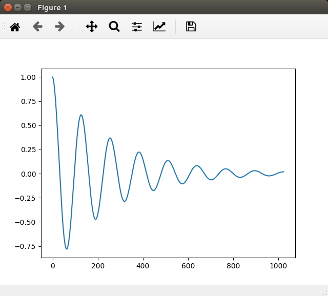

# Plotting Data using Matplotlib from C++

I had to write some code in C++ where I wanted to plot the results of a 
signal processing function.  
The existing C++ plotting libraries had quite a learning curve, and I was 
already familiar with Python's Matplotlib already, so I didn't want to learn an
entirely new library.  
I then found [matplotlib-cpp](https://github.com/lava/matplotlib-cpp), C++ 
bindings for Matplotlib. It worked fine, but was quite limited.  
However, that gave me the idea to use pybind11 to call Python Matplotlib code
from my C++ applications.

The results are great. The C++ code just does all of its calculations, starts 
the Python interpreter, and passes the data to be plotted to a piece of Python
code that uses Matplotlib to display the data.

This repository is a simple template that I use myself when I start a new 
project where I want to plot data from C++.  
It contains a very simple C++ example program and a CMakeLists.txt file that 
builds the application.  
There are also build tasks for Visual Studio Code, which I use as my main 
editor.

## Installing the Dependencies

To build and run the example, you need a the usual tools: a compiler, make, 
cmake.

~~~sh
sudo apt install g++ make cmake
~~~

You also need Python 3, of course. Either install them through the repositories:

~~~sh
sudo apt install python3-dev python3-pip
~~~

Or if you want the latest Python version, check out these instructions on how to
build it yourself: 
[building Python 3 from source](https://tttapa.github.io/Pages/Ubuntu/Software-Installation/Python.html)

You'll also need Matplotlib for the plots:

~~~sh
python3 -m pip install --user matplotlib
~~~

Next, install pybind11:

~~~sh
cd /tmp
git clone https://github.com/pybind/pybind11 --depth=1
mkdir pybind11/build && cd pybind11/build
cmake .. -DPYBIND11_TEST=OFF
sudo make install
# Install without sudo
# cmake .. -DPYBIND11_TEST=OFF -DCMAKE_INSTALL_PREFIX=$HOME/.local
# make install
# echo "export CMAKE_PREFIX_PATH=$HOME/.local/lib/cmake" >> ~/.profile # TODO: check
~~~

Finally, just clone this repository:

~~~sh
cd
git clone https://github.com/tttapa/Pybind11-Matplotlib-Cpp
~~~

## Building and Running the Example using the Command Line

Create a `build` directory, and run CMake. You can specify the path to your 
Python executable if you want to use a specific one, otherwise, just use `which`
to determine the default one.

~~~sh
cd Pybind11-Matplotlib-Cpp
mkdir build && cd build
cmake .. -DPYTHON_EXECUTABLE=`which python3`
~~~

Next, simply run Make to build:

~~~sh
make
~~~

Finally, run the application:

~~~sh
./main
~~~

You should see a Matplotlib plot opening.

## Building and Running the Example using Visual Studio Code

I also included some build tasks for Visual Studio Code that you can use.  
To build the application in VSCode, open this folder using `Ctrl+K Ctrl+O`, 
then hit `Ctrl+P`, type `task`, then a space and then "Clear build Directory
and Run CMake". Press enter to execute the task.  
Next, hit `Ctrl+Shift+B`, select "Build & Run" using the arrow keys, and hit
enter to build and run the application.

There are other tasks for running "make clean" and for building without running
the application as well.

VSCode will probably give you a warning that `Python.h` was not found in the
include path. You can just click the yellow light bulb, and select `Add to 
"includePath": /usr/include/python3.x`.